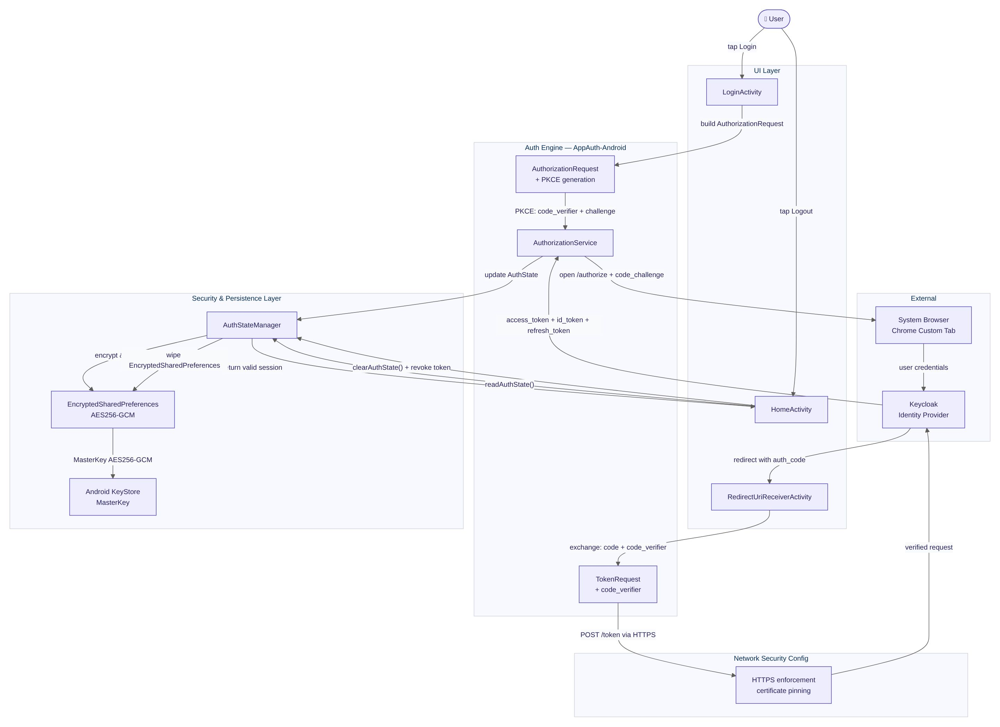

# 🔐 MyAuthApp

Secure Android authentication demo using **OAuth2 Authorization Code Flow + PKCE** with **Keycloak** as the Identity Provider.

Built to simulate real-world authentication systems with a focus on **security, token lifecycle management, and clean architecture**.

---

## 🚀 Key Highlights

- 🔐 Secure OAuth2 + PKCE flow (prevents authorization code interception)
- 🌐 Browser-based authentication via Chrome Custom Tabs (no WebView risks)
- 🧠 OpenID Connect (OIDC) compliant identity handling
- 🔄 Token lifecycle management (access, refresh, ID tokens)
- 🐳 Local Keycloak setup using Docker
- 🏗️ Modular architecture separating auth, storage, and UI layers

---

## 📱 Screenshots

> Login → Keycloak → Redirect → Authenticated Home
> 
> 
> 
> 

---

## 🛠️ Tech Stack

| Technology | Purpose |
| --- | --- |
| Kotlin | Android development |
| AppAuth | OAuth2 / OIDC implementation |
| Keycloak | Identity & Access Management |
| Docker | Local Keycloak setup |
| Chrome Custom Tabs | Secure authentication UI |
| SharedPreferences | Token storage (demo only) |

---

## 🏗️ Architecture Flow

```
LoginActivity
   ↓
fetchFromIssuer()  (OIDC discovery)
   ↓
Chrome Custom Tab (Auth Request)
   ↓
Keycloak Login
   ↓
Redirect with Authorization Code
   ↓
Token Exchange (Code + PKCE Verifier)
   ↓
AuthStateManager (store tokens)
   ↓
HomeActivity
```

---

## 🔐 Security Considerations

- ✅ PKCE prevents authorization code interception attacks
- ✅ Chrome Custom Tabs avoids WebView-based credential leaks
- ⚠️ SharedPreferences used only for demo (not secure for production)

### 🔥 Production Improvements

- Use **EncryptedSharedPreferences + Android KeyStore**
- Enforce **HTTPS-only communication**
- Implement **certificate pinning**
- Add **secure logout & token revocation**
- Use **hardware-backed encryption for token storage**

---

## 🚀 Getting Started

### Prerequisites

- Android Studio
- Docker
- Android Emulator (API 24+)

---

### 1️⃣ Start Keycloak

```
docker run-p8080:8080 \
-eKEYCLOAK_ADMIN=admin \
-eKEYCLOAK_ADMIN_PASSWORD=admin \
  quay.io/keycloak/keycloak:24.0.1 start-dev
```

---

### 2️⃣ Configure Keycloak

- Open: [http://localhost:8080](http://localhost:8080/)
- Login: `admin / admin`

Create:

- Realm → `myrealm`
- Client → `android-app` (public)
- Redirect URI → `com.tcf.myauthapp://*`
- Create a test user (email verified)

---

### 3️⃣ Run the App

- Update `Constants.kt`
- Run on emulator
- Click **Login → authenticate → redirected back**

---

## 📂 Project Structure

```
com.tcf.myauthapp/
├── Constants.kt               # Configuration values
├── AppAuthConnectionBuilder  # HTTP support (dev only)
├── AuthStateManager          # Token management
├── LoginActivity             # Authentication entry point
└── HomeActivity              # Post-login UI
```

---

## 🧠 What I Learned

- OAuth2 Authorization Code Flow with PKCE (end-to-end)
- OpenID Connect (OIDC) fundamentals
- Secure mobile authentication best practices
- Token lifecycle (access, refresh, ID tokens)
- Keycloak setup (realm, client, users)
- AppAuth integration in Android

---

## ⚠️ Important Note

`AppAuthConnectionBuilder.kt` is used **only for local HTTP testing**.

❌ Do **NOT** use in production.

---

## 📈 Future Enhancements

- 🔐 Encrypted token storage (Jetpack Security + KeyStore)
- 🌍 Multi-environment support (dev / staging / prod)
- 📡 Backend API integration using access tokens
- 🔄 Silent token refresh handling
- 🧪 Unit & integration tests for authentication flows

---

## 📄 License

MIT License
